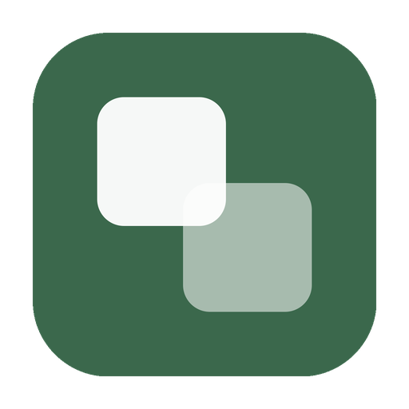

  

<h1 align="center">Onevium</h1>

  <strong>Automate the browser, schedule the work, deploy bots — all from one desktop.</strong>

  A native desktop app that lets AI browse the web, run agents on a schedule, and push results into your team channels.

  
  
  

---

## Browser Automation

**Act across live web surfaces.**

Navigate pages, fill forms, inspect console output, read network activity, and return results through the same desktop conversation surface.

- Navigate tabs and pages with natural language
- Fill forms and capture screenshots along the way
- Read console and network output without leaving the flow
- Works with Chrome, Edge, Arc, Brave, Vivaldi, Opera, Chromium

## Scheduled Workflows

**Turn prompts into recurring jobs.**

Daily QA passes, release notes, sprint digests, and operational checks should not depend on somebody remembering to ask. Schedules make the product behave like a system.

- Recurring jobs with clear run timing
- Manual trigger when you need to rerun now
- Notification routing back to the right team room

## Channel Bots

**Deploy workflows into team channels.**

Channel bots let the same workflows show up where teams already work together — Feishu, DingTalk, and Discord.

- Per-user or shared session models
- Role-specific bots for release, QA, docs, and ops
- Cross-bot collaboration without hiding the control model

## Visible Control

**Keep tool calls and approvals visible.**

The UI makes automation feel trustworthy. Reads, edits, shell commands, and permissions stay inspectable instead of disappearing behind a black box.

- Real-time tool execution visibility
- Approval modes that match your trust boundary
- File rewind and session-level control for safer iteration

## MCP Extensibility

**Connect to any external service.**

Extend capabilities through Model Context Protocol servers — databases, APIs, cloud services, and custom integrations.

- User-level (global) or project-level scoping
- Popular integrations: PostgreSQL, MySQL, GitHub, GitLab, Slack, Linear, Notion, AWS, GCP, Cloudflare

## Skills & Agents

**Build reusable workflows.**

Create custom skills (slash commands) and agents with specific system prompts, model preferences, tool restrictions, and permission modes.

- Reusable markdown templates invoked with `/`
- Custom agents with scoped permissions per task
- Project-level or global skill definitions

---

## Download

Download the latest version from the [Releases](https://github.com/Onevium/Onevium/releases/latest) page.

| Platform | Architecture | Format |
|----------|-------------|--------|
| macOS | Apple Silicon (M1/M2/M3/M4) | `.dmg` |
| macOS | Intel | `.dmg` |
| Windows | x64 | `.exe` (NSIS installer) |
| Linux | x64 | `.AppImage` |
| Linux | ARM64 | `.AppImage` |

## Installation

**macOS** — Open the DMG, drag Onevium to Applications. On first launch, right-click and select "Open".

**Windows** — Run the installer and follow the prompts.

**Linux** — `chmod +x Onevium-*.AppImage && ./Onevium-*.AppImage`

## Requirements

- macOS 12+ / Windows 10+ / Ubuntu 20.04+
- Anthropic API key or Claude Pro/Max subscription

## Links

- [Website](https://onevium.com)
- [Documentation](https://onevium.com/docs)
- [Pricing](https://onevium.com/pricing)
- [Changelog](https://onevium.com/changelog)
- [Blog](https://onevium.com/blog)
- Support: support@onevium.com
