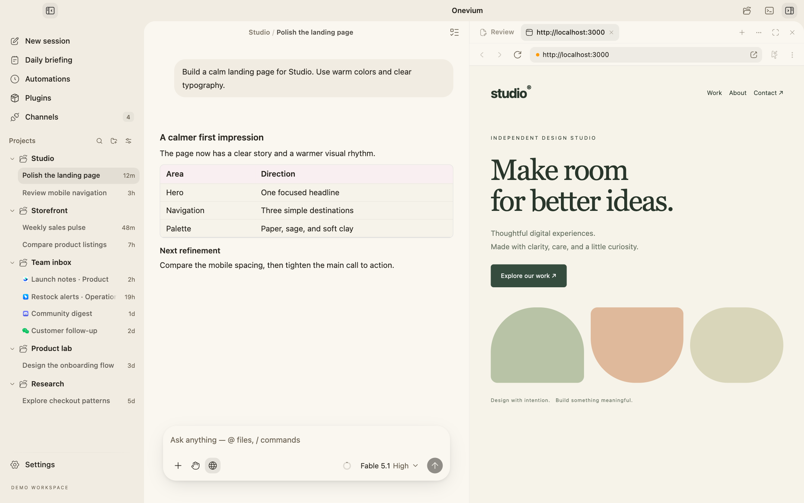
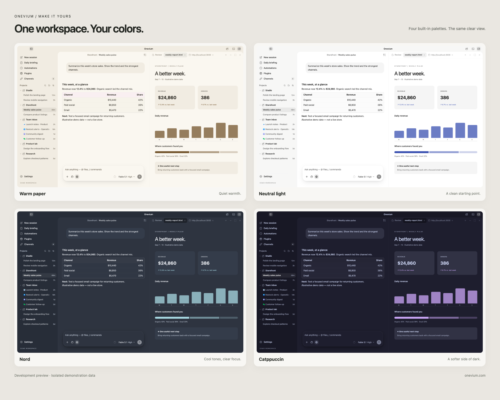
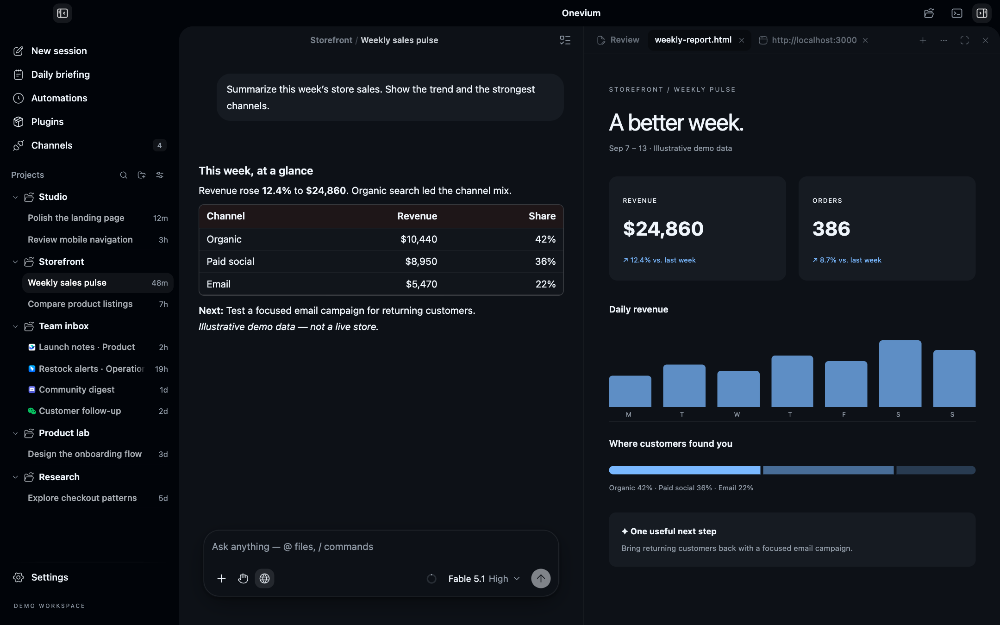
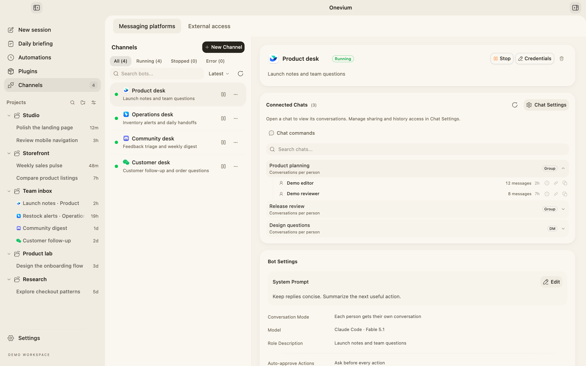

# Onevium

### Give your ideas a better place to take shape.

Conversations, browser previews, charts, and projects. From a question to a result you can see.

**1.2.2 · Edit files, keep background work moving, and control MCP tools**

[Download 1.2.2](https://github.com/Onevium/Onevium/releases/latest) · [Explore 1.2.2](releases/1.2.2.md) · [Documentation](https://onevium.com/docs) · [简体中文](README.zh-CN.md)

**Describe the idea. See it take shape beside you.** Refine a page, inspect the preview, and keep the conversation in the context of your project.

> Screens show the 1.2.0 workspace with synthetic demonstration data. Reports and connection states are illustrative. See the 1.2.2 notes for the latest changes.

## New in 1.2.2

- **Work with files beside the conversation.** Open local file references, edit Markdown, text, and CSV, and preview PDF, Word, PowerPoint, and Excel files.
- **Keep delegated work moving.** Background tasks and child conversations can continue after the main conversation is interrupted; child conversations stay grouped with their parent.
- **Choose the tools a task needs.** Control MCP availability, tool allowlists, and on-demand loading by global, project, or conversation scope.
- **Use updated models and clearer controls.** Optional Grok 4.7, Claude Opus 5.5, and GPT-6 Sol/Luna entries join the catalog, with browser form handling and multi-repository Review improvements.

[Read the 1.2.2 changelog →](releases/1.2.2.md)

## A workspace that feels like yours

1.2.0 revisits the visual structure of conversations, sidebars, the composer, settings, and previews. Clearer hierarchy, quieter controls, and coordinated palettes give the workspace more character while keeping the work in focus.

Choose the warmth of paper, the clarity of light, the calm of Nord, or the softer colors of Catppuccin.

## See the story in the work

A weekly store report can be more than a wall of numbers. Give the summary, trend, and channel comparison their own space. See what happened, then decide what to try next.

This example turns synthetic sales data into revenue, orders, a daily trend, and channel share—with one concise recommendation.

## Keep the context. Know the source.

Organize development, operations, and research by project. Recognize conversations from Feishu, DingTalk, Discord, and WeChat by their platform icons. Browse bots, connected chats, and member histories alongside the rest of your work.

*Reports, connection states, members, and message counts are demonstration data. No live store or messaging account is shown.*

## Small interactions, thoughtfully improved

- **Return to the page you were working on.** Each conversation keeps its own browsing history, with search, progressive loading, and quick reopening.
- **Make room for split work.** Information cards step aside during conversation dragging, and visibility preferences remain independent for each conversation.
- **A quieter place to type.** A wider address bar and subtler focus treatments make browser input and model filtering less visually intrusive.
- **Bring diagrams and skills into the task.** Diagram presentation and editing continue to improve. Start from a skill detail page with an editable draft in the selected project.

[Read the full 1.2.0 notes →](releases/1.2.0.md)

## Get started

[Install helpers](install/README.md) · [Quick guides](guides/README.md) · [Example tasks](examples/README.md) · [Changelog](CHANGELOG.md)

## Start with one concrete task

1. Download the [current installer](https://github.com/Onevium/Onevium/releases/latest) for your platform.
2. Follow the [setup documentation](https://onevium.com/docs) to configure your account or provider.
3. Open a project and describe a goal: refine a page, prepare a report, or explore a dataset.

| Platform | Architecture | Installer |
| --- | --- | --- |
| macOS | Apple Silicon / Intel | DMG |
| Windows | x64 | EXE |

See the [installation guide](https://onevium.com/docs/installation) for setup and update instructions.

## Skills community and learning resources

Explore reusable skills in the [Onevium skills community](https://github.com/Onevium/onevium-skill-community), and visit the [official documentation](https://onevium.com/docs) for usage guides and complete tutorials. This repository provides desktop downloads, product showcases, and getting-started resources; skill content is maintained in the community repository.

[Website](https://onevium.com) · [Releases](https://github.com/Onevium/Onevium/releases) · [Feedback](https://github.com/Onevium/Onevium/issues) · support@onevium.com

This repository contains public product information and releases. It does not contain the application's source code.
