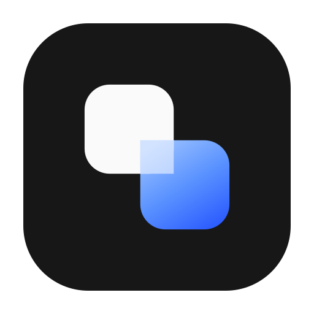
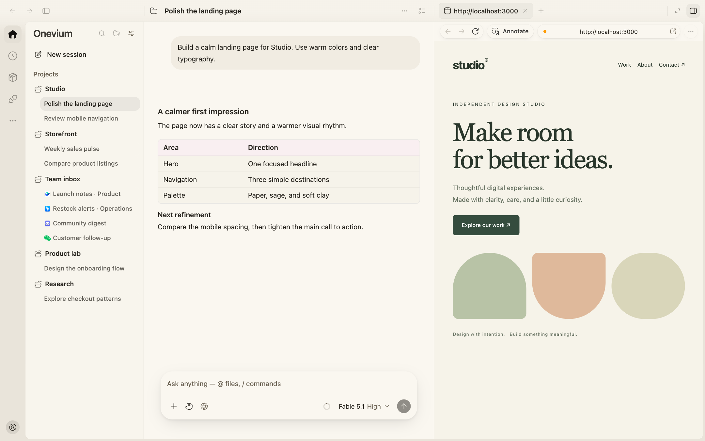
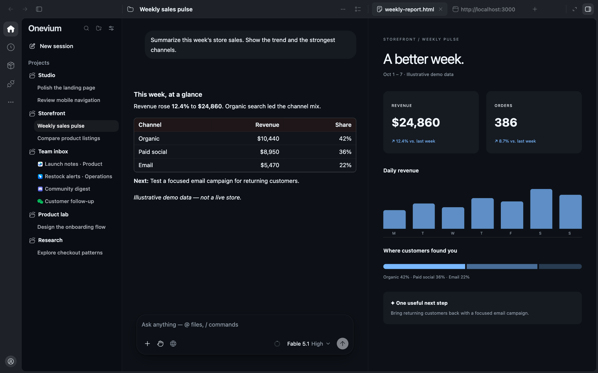
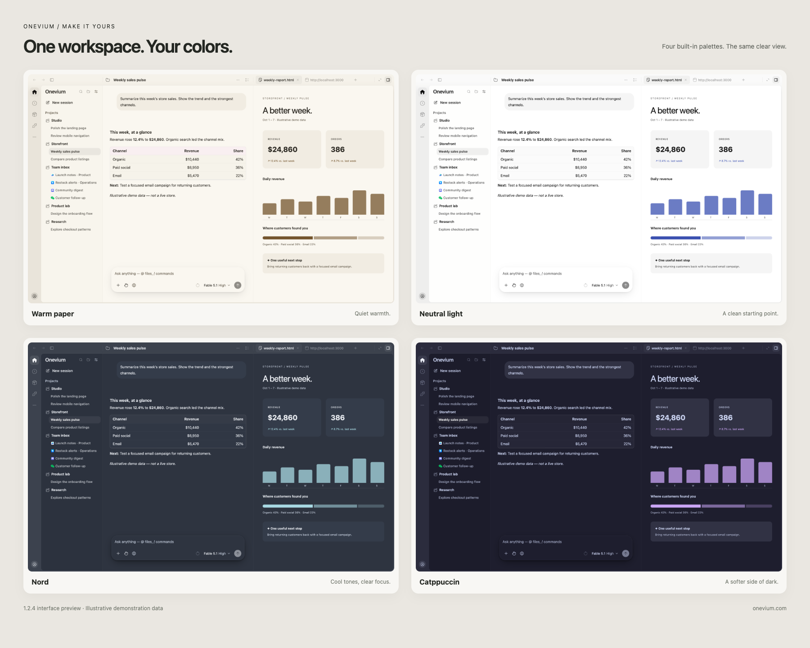

<div align="center">



# Onevium

### Bring your ideas to life. Keep the results in view.

A project-based AI workspace. Write code, browse the web, create images, and work with files—with the conversation and its results together.

**Projects & conversations · Browser · Files & Review · Image creation · Skills & automation**

[Download stable](https://github.com/Onevium/Onevium/releases/latest) · [Quick install](#quick-install) · [Documentation](https://onevium.com/docs) · [简体中文](README.zh-CN.md)

</div>



> **A preview of 1.3.0.** This page introduces the upcoming version. The current public stable release is **1.2.3**; the commands below download the latest stable release, not the unpublished 1.3.0. Screenshots were captured during 1.2.4 development using real interface components in an isolated demo, with synthetic projects, conversations, and reports.

## Quick install

**macOS · Apple Silicon / Intel** — paste this line into Terminal:

```sh
curl -fsSL https://raw.githubusercontent.com/Onevium/Onevium/main/install/install.sh -o onevium-install.sh && sh onevium-install.sh
```

The helper detects your architecture, downloads the official stable installer, checks its SHA-256, and opens the installer. Drag Onevium into Applications to finish. Quit a running copy of Onevium before updating.

**Windows x64** — run in PowerShell:

```powershell
$p = Join-Path $env:TEMP 'onevium-install.ps1'; Invoke-WebRequest 'https://raw.githubusercontent.com/Onevium/Onevium/main/install/install.ps1' -OutFile $p -UseBasicParsing -ErrorAction Stop; & $p
```

This saves and runs the helper under your existing execution policy, verifies the installer, and opens its setup wizard. The Windows command has not yet been tested on a Windows host; use a direct download if your policy blocks scripts.

| Platform | Current stable installer |
| --- | --- |
| macOS · Apple Silicon | [Download arm64 DMG](https://github.com/Onevium/Onevium/releases/download/v1.2.3/Onevium-1.2.3-arm64.dmg) |
| macOS · Intel | [Download x64 DMG](https://github.com/Onevium/Onevium/releases/download/v1.2.3/Onevium-1.2.3-x64.dmg) |
| Windows · x64 | [Download EXE](https://github.com/Onevium/Onevium/releases/download/v1.2.3/Onevium-Setup-1.2.3.exe) |

The current stable release has no Linux or Windows arm64 installer. [Inspect the helpers, choose a version, and read installation details](install/README.md) · [Compatibility and signing notes](https://onevium.com/docs/installation)

## From a question to something you can use

Keep the conversation, web pages, files, and previews for a task in one project. Ask AI to do the work, inspect the result beside it, and continue with the next change.

| What you want to do | How Onevium helps |
| --- | --- |
| **Build a product page** | Discuss requirements in the project, edit files, open a web preview, and inspect the changes in Review. |
| **Prepare a data report** | Work with files, analyze the data, put the summary beside its charts, and ask what to do next. |
| **Explore another approach** | In 1.3.0, branch a new conversation from an existing reply; use a separate Git worktree for development tasks. |
| **Create and edit images** | In 1.3.0, connect an image service, start with a prompt or reference, then mark regions and add notes to guide the next edit. |
| **Continue everyday work** | Keep context in projects, reuse processes with Skills, and schedule the next run. |

## In 1.3.0: more ways to arrange your work

### A workspace that follows the task

The new navigation rail, sidebar, and tabs bring projects, conversations, and results together. Browser pages, files, terminal, and Review each have a place. When a preview needs more room, dock the conversation in a corner and continue through its floating panel.

Inspect the current turn's changes, branch differences, or the whole workspace. Add comments beside code lines and ask AI to continue. For projects with multiple Git repositories, select the relevant repository or isolate a task in a worktree.

[Files, terminal, and Review](https://onevium.com/docs/files-terminal-review) · [Worktrees](https://onevium.com/docs/worktrees)

### Follow a new direction, or return to an earlier point

Create a new conversation from an existing reply to explore another approach while keeping the original discussion. Preview the rewind scope, then choose to rewind just the conversation or also restore recorded file changes. File restoration may be unavailable when history is missing or conflicts exist.

[Projects and conversations](https://onevium.com/docs/projects-and-sessions)

### Separate identities inside the browser

Choose an identity for each browser tab to use work and test accounts on the same site. Set the default identity for new pages, or clear one site's data without clearing everything else.

On macOS, import cookies and saved passwords from Chrome, Edge, or Brave, and manage saved passwords in the browser settings. **Importing cookies does not guarantee a signed-in session**; sites may still require a fresh login or verification.

[Browser guide](https://onevium.com/docs/browser-automation)

### Make image creation part of the task

Connect a supported OpenAI or Google Gemini image service and bring prompts, references, and edit requests into the conversation. Mark regions, add notes, compare before and after, browse previous versions, and save the result you want.

Image creation needs a separately configured image service and its tools enabled. Available models and costs depend on the connected service.

[Image creation and canvas](https://onevium.com/docs/image-creation)

## Turn data into a useful conversation

“Analyze this week’s store data, chart the revenue trend, and suggest one experiment for next week.”

Start with a small table. Put the summary, trend, and channel comparison in the same workspace, then discuss what the evidence means.



*Sales, orders, channels, and conclusions in this example are synthetic. No live store is shown.*

[Try the development and reporting examples](examples/README.md) · [Chart workflows](https://onevium.com/docs/widget-workflows)

## Bring your services. Build your own way of working.

- **Choose a model service.** Sign in to Claude Code, or configure a supported provider or custom connection. Your Onevium account and license are separate from model-service access. [Connection guide](https://onevium.com/docs/providers)
- **Save repeatable processes as Skills.** Define inputs, steps, and deliverables for recurring work; connect tools through MCP and plugins. [Skills](https://onevium.com/docs/skills) · [MCP](https://onevium.com/docs/mcp-servers) · [Plugins](https://onevium.com/docs/plugins)
- **Give different roles a task.** Use specialized agents and team collaboration, follow their progress, and review the results. [Team workflows](https://onevium.com/docs/teams)
- **Schedule recurring work.** Run scheduled tasks while Onevium is running on your computer. [Scheduled automation](https://onevium.com/docs/scheduled-runs)
- **Connect messaging channels.** Configure Feishu, DingTalk, Discord, or WeChat as another entry point for conversations. [Channel guide](https://onevium.com/docs/team-channels)

## Choose a theme for the work ahead

Warm paper, Neutral light, Nord, or Catppuccin: keep the sidebar, conversation, and preview in tune. Here is the same synthetic report in four built-in palettes.



## Open it. Finish one small task.

1. Install Onevium, complete account sign-in or license activation, and connect an available model service.
2. Choose a project directory and create a conversation.
3. Give it one concrete goal: **“Build a clear product page for this project, show me the preview, and list the files you changed.”**
4. Inspect the results and file changes, then refine them. Add a Skill when you want to reuse the process.

[Getting started](https://onevium.com/docs/getting-started) · [Quick guides](guides/README.md) · [Onevium skills community](https://github.com/Onevium/onevium-skill-community)

---

[Website](https://onevium.com) · [Documentation](https://onevium.com/docs) · [Changelog](CHANGELOG.md) · [Feedback](https://github.com/Onevium/Onevium/issues) · support@onevium.com

This repository contains product information, demo assets, public installation helpers, and Release installers. It does not contain the application's source code. The 1.3.0 preview may change; see [Releases](https://github.com/Onevium/Onevium/releases) for the changes in published versions.
